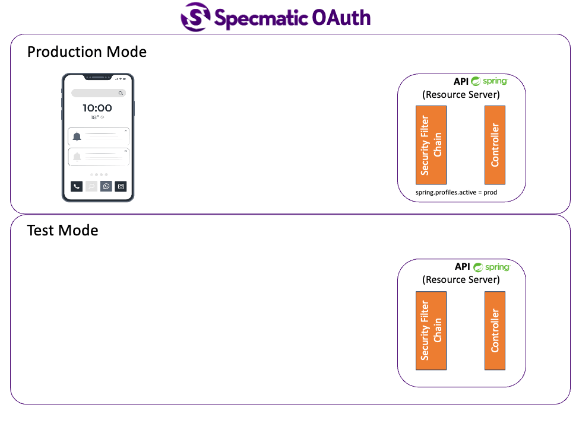

# Specmatic Sample: Ktor Backend (gRPC)

Table of Contents
* [Background](#background)
* [Why Specmatic](#why-specmatic)
* [Tech](#tech)
* [Run Contract Tests](#run-contract-tests)
* [How It Works](#how-it-works)
* [Configuration](#configuration)
* [Project Structure](#project-structure)
* [For More Info](#for-more-info)

## Background

In this sample project, we use Specmatic to contract test a Kotlin backend over gRPC. Specmatic reads the Protobuf contracts and auto-generates gRPC requests against the running service. The sample uses [ProductService's proto](https://github.com/specmatic/specmatic-order-contracts/blob/main/io/specmatic/examples/store/grpc/order_api/product.proto) and [OrderService's proto](https://github.com/specmatic/specmatic-order-contracts/blob/main/io/specmatic/examples/store/grpc/order_api/order.proto) from the Specmatic order contracts repo. This backend owns in-memory product and order state, so no downstream service has to run locally.

## Why Specmatic

* **Auto-generated tests from your API spec** - Specmatic reads the gRPC Protobuf definitions and generates test cases automatically.
* **Intelligent service virtualisation** - the same contract source can be used to create realistic stubs for consumers.
* **Backward compatibility detection** - Specmatic can compare spec versions and flag breaking changes before they reach production.
* **Tests your Protobuf service definitions** - validates the gRPC surface without spinning up dependent services.



## Tech

1. Kotlin 2.2.0 targeting JDK 17
2. Ktor 3.2.0 dependency with grpc-kotlin/Netty as the protocol runtime
3. Specmatic Enterprise Docker image `specmatic/enterprise:1.19.1`
4. Docker Desktop or Docker Engine for running Specmatic

## Run Contract Tests

### Prerequisites

* JDK 17+
* Docker
* `SPECMATIC_LICENSE_KEY` when your environment does not already provide an Enterprise license
* Specmatic Enterprise runtime: `specmatic/enterprise:1.19.1`

For **Unix based systems** and **Windows PowerShell**:

```shell
./scripts/test.sh
```

For **Windows Command Prompt**:

```shell
bash scripts/test.sh
```

First run may take 1-2 minutes as Specmatic clones the configured contract repository. Subsequent runs are fast, cached in `.specmatic/`.

The [specmatic.yaml](specmatic.yaml) file configures the contract repo, the two gRPC specs to test, the Docker runtime values, and report generation.

#### View Specmatic Test Reports

After running the contract tests, you can view the HTML report generated by Specmatic in [build/specmatic-reports/grpc/test/html](build/specmatic-reports/grpc/test/html/). The same report tree contains CTRF output at `build/specmatic-reports/grpc/test/ctrf/ctrf-report.json`.

### Test Modes

This sample ships with `schemaResiliencyTests: all` which runs the full test suite including negative/boundary tests. You can adjust the mode in `specmatic.yaml`:

| Mode | What it does |
|------|-------------|
| `none` | Runs tests from named examples only |
| `positiveOnly` | Adds all valid input combinations |
| `all` | Adds negative/boundary tests |

To change, update `specmatic.yaml`:

```yaml
specmatic:
  settings:
    test:
      schemaResiliencyTests: none
```

## How It Works

API Spec (Protobuf) -> `specmatic.yaml` -> Specmatic generates gRPC requests -> the Kotlin service responds -> Specmatic validates responses against the spec.

When you run the test script, Maven builds the service, the script starts the gRPC server, stages imported proto support files for Specmatic descriptor generation, and runs `specmatic/enterprise:1.19.1` with the root `specmatic.yaml`.

## Configuration

| Environment Variable | Default | Description |
|---------------------|---------|-------------|
| `SUT_PORT` | `8080` | gRPC server port |
| `SUT_HOST_FOR_SPECMATIC` | `host.docker.internal` | Hostname used by the Specmatic Docker container |
| `SPECMATIC_IMAGE` | `specmatic/enterprise:1.19.1` | Enterprise Docker image |
| `SPECMATIC_LICENSE_KEY` | unset | Enterprise license key when required |

## Project Structure

| File | Purpose |
|------|---------|
| `specmatic.yaml` | Contract test configuration for ProductService and OrderService |
| `pom.xml` | Kotlin, Ktor, gRPC, and Protobuf build configuration |
| `src/main/proto/order_api` | Protobuf contracts used to generate server interfaces |
| `src/main/kotlin/io/specmatic/examples/store` | In-memory backend and gRPC service implementations |
| `scripts/test.sh` | Builds the app, starts it, and runs Specmatic Enterprise via Docker |
| `Dockerfile` | Production container image |
| `.github/workflows/ci.yml` | CI pipeline for test and Docker build |

## For More Info

* [Specmatic Website](https://specmatic.io)
* [Specmatic Documentation](https://docs.specmatic.io)
* [Order API gRPC contracts](https://github.com/specmatic/specmatic-order-contracts/tree/main/io/specmatic/examples/store/grpc/order_api)
