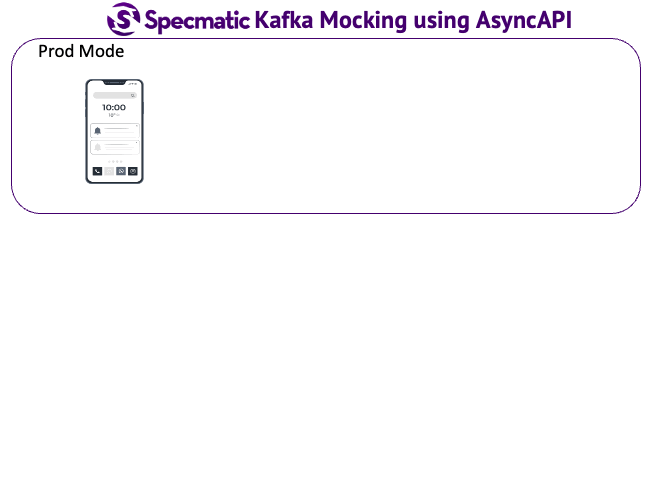

# Specmatic Sample: Express BFF (REST/OpenAPI)

Table of Contents
* [Background](#background)
* [Tech](#tech)
* [Run Contract Tests](#run-contract-tests)
* [How It Works](#how-it-works)
* [Project Structure](#project-structure)
* [For More Info](#for-more-info)

## Background

In this sample project, we use Specmatic to contract test a TypeScript Express BFF in isolation. Specmatic auto-generates REST contract tests from the BFF OpenAPI spec, starts dependency mocks from the backend OpenAPI and Kafka AsyncAPI specs, and verifies that the BFF response shape stays aligned with the executable contracts.

* [Product Search BFF OpenAPI spec](https://github.com/specmatic/specmatic-order-contracts/blob/main/io/specmatic/examples/store/openapi/product_search_bff_v6.yaml) is used for running contract tests against the BFF.
* [Order API OpenAPI spec](https://github.com/specmatic/specmatic-order-contracts/blob/main/io/specmatic/examples/store/openapi/api_order_v5.yaml) is used for stubbing the REST backend dependency.
* [Product audit AsyncAPI spec](https://github.com/specmatic/specmatic-order-contracts/blob/main/io/specmatic/examples/store/asyncapi/kafka.yaml) is used for the Kafka dependency boundary.

## Why Specmatic

* **Auto-generated tests from your API spec** - Specmatic reads the OpenAPI spec and generates test cases automatically.
* **Intelligent service virtualisation** - Specmatic mocks backend dependencies from the same contracts the BFF consumes.
* **Single source of truth** - one set of specs drives contract tests, dependency mocks, and compatibility checks.
* **Works with your existing OpenAPI and AsyncAPI specs** - no new DSL is required for this sample.



## Tech

1. TypeScript BFF written with Express 5.2.1 on Node.js 20
2. Specmatic Enterprise Docker image `specmatic/enterprise:1.19.1`
3. Docker Desktop or Docker Engine for the `docker-cli` integration mode
4. Redpanda Kafka-compatible broker container for the AsyncAPI mock boundary
5. npm for dependency installation and test orchestration

## Run Contract Tests

### Prerequisites

* Node.js 20+
* Docker Desktop or Docker Engine
* A valid `SPECMATIC_LICENSE_KEY` for `specmatic/enterprise:1.19.1`

For **Unix based systems** and **Windows PowerShell**:

```shell
npm install
npm test
```

For **Windows Command Prompt**:

```bat
npm install
npm test
```

First run may take 1-2 minutes as Specmatic clones the configured contract repository. Subsequent runs are fast because contracts are cached in `.specmatic/`.

The [specmatic.yaml](specmatic.yaml) file configures the BFF contract, the REST backend mock, the Kafka dependency mock, report formats, and runtime endpoint values.

#### View Specmatic Test Reports

After running the contract tests, you can view the HTML report generated by Specmatic in [build/reports/specmatic](build/reports/specmatic/). The same directory also contains the CTRF output for CI tooling.

### Test Modes

This sample ships with `schemaResiliencyTests: all` which runs the full test suite including negative and boundary tests. You can adjust the mode in `specmatic.yaml`:

| Mode | What it does |
|------|-------------|
| `none` | Runs tests from named examples only |
| `positiveOnly` | Adds all valid input combinations |
| `all` | Adds negative and boundary tests and expects 400 for invalid inputs |

```yaml
specmatic:
  settings:
    test:
      schemaResiliencyTests: none
```

## How It Works

BFF Spec -> specmatic.yaml -> Specmatic generates requests to your BFF -> Your BFF calls dependencies mocked by Specmatic -> Specmatic validates both sides.

When you run `npm test`, the build compiles the TypeScript source, builds the BFF Docker image, starts a disposable Redpanda broker, and runs the Specmatic Enterprise Docker image against `specmatic.yaml`. Specmatic fetches the configured contracts, generates requests from the BFF OpenAPI spec, and starts mocks for the backend contracts.

### Configuration

| Environment Variable | Default | Description |
|---------------------|---------|-------------|
| `SUT_PORT` | `8080` | Express application port |
| `SUT_BASE_URL` | `http://localhost:8080` | BFF URL used by Specmatic in the shared Docker network namespace |
| `APP_STUB_BASE_URL` | `http://localhost:8090` | REST dependency mock URL used by the BFF |
| `STUB_BASE_URL` | `http://0.0.0.0:8090` | REST dependency mock bind URL used by Specmatic |
| `APP_KAFKA_BROKER_URL` | `localhost:9092` | Kafka broker URL used by the BFF |
| `KAFKA_BROKER_URL` | `localhost:9092` | Kafka broker URL used by Specmatic |
| `KAFKA_CONTAINER_NAME` | `specmatic-sample-redpanda` | Disposable broker container name |
| `SPECMATIC_REPORT_DIR` | `build/reports/specmatic` | Specmatic HTML and CTRF report directory |

## Project Structure

| File | Purpose |
|------|---------|
| `specmatic.yaml` | Contract test configuration pointing to the BFF and dependency specs |
| `src/server.ts` | Express BFF routes and contract-driven adapter behavior |
| `src/backendClient.ts` | REST dependency client used by BFF workflows |
| `src/auditPublisher.ts` | Kafka audit publisher for product search side effects |
| `scripts/test.sh` | Starts the broker, BFF container, and Specmatic Enterprise Docker CLI |
| `Dockerfile` | Production container image |
| `.github/workflows/ci.yml` | CI pipeline: install, test, upload reports, and build Docker image |

## For More Info

* [Specmatic Website](https://specmatic.io)
* [Specmatic Documentation](https://docs.specmatic.io)
* [Product Search BFF contract](https://github.com/specmatic/specmatic-order-contracts/blob/main/io/specmatic/examples/store/openapi/product_search_bff_v6.yaml)
