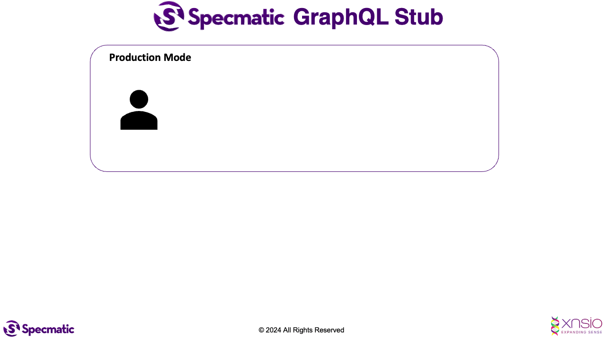

# Specmatic Sample: React Frontend (REST/OpenAPI)

Table of Contents
* [Background](#background)
* [Why Specmatic](#why-specmatic)
* [Tech](#tech)
* [Run Contract Tests](#run-contract-tests)
* [How It Works](#how-it-works)
* [Configuration](#configuration)
* [Project Structure](#project-structure)
* [For More Info](#for-more-info)

## Background

In this sample project, we use Specmatic to contract test a React frontend that consumes a REST/OpenAPI Order BFF API. Specmatic starts a mock from the BFF OpenAPI spec, and the frontend client workflows call that mock instead of relying on a live backend. The [Order BFF OpenAPI spec](https://github.com/specmatic/specmatic-order-contracts/blob/main/io/specmatic/examples/store/openapi/product_search_bff_v6.yaml) is used for stubbing the BFF boundary and verifying the create product, find available products, create order, retrieve orders, and monitor workflows.

## Why Specmatic

* **Auto-generated mocks from your API spec** - Specmatic reads the OpenAPI spec and serves realistic responses without hand-written mock code.
* **Intelligent service virtualisation** - frontend work can continue while the BFF or its backend dependencies are unavailable.
* **Single source of truth** - one OpenAPI spec drives the mock, request matching, and compatibility expectations.
* **Works with your existing OpenAPI spec** - no new DSL is needed for REST contracts.



## Tech

1. React 19 frontend written in TypeScript
2. Specmatic Enterprise Docker image `specmatic/enterprise:1.19.0`
3. Docker Desktop or another Docker Engine for Testcontainers
4. Node.js `>=22.12.0`

## Run Contract Tests

### Prerequisites

* Node.js `>=22.12.0`
* Docker
* `SPECMATIC_LICENSE_KEY` for `specmatic/enterprise:1.19.0`

When using Colima locally, set `DOCKER_HOST` and `TESTCONTAINERS_DOCKER_SOCKET_OVERRIDE` for Testcontainers, for example:

```shell
DOCKER_HOST=unix://$HOME/.colima/default/docker.sock TESTCONTAINERS_DOCKER_SOCKET_OVERRIDE=/var/run/docker.sock npm test
```

The [specmatic.yaml](specmatic.yaml) file configures the contract repository, BFF spec path, mock endpoint, and Specmatic report formats. First run may take 1-2 minutes as Specmatic clones the configured contract repository. Subsequent runs are fast, cached in `.specmatic/`.

### Using the build tool

For **Unix based systems** and **Windows PowerShell**:

```shell
npm ci
npm test
```

For **Windows Command Prompt**:

```cmd
npm ci
npm test
```

### Using Docker

The tests use Testcontainers, so Docker is started by the test process. No direct `docker run` command is needed for normal use.

#### View Specmatic Test Reports

After running the contract tests, Specmatic writes the HTML report in [build/reports/specmatic/stub/html](build/reports/specmatic/stub/html/) and the CTRF report in [build/reports/specmatic/stub/ctrf](build/reports/specmatic/stub/ctrf/).

### Test Modes

This sample ships with `schemaResiliencyTests: all`. For this frontend sample Specmatic runs in mock mode, so the frontend test suite determines the executed workflow count. You can still adjust the mode in `specmatic.yaml`:

| Mode | What it does |
|------|-------------|
| `none` | Runs tests from named examples only |
| `positiveOnly` | Adds all valid input combinations |
| `all` | Adds negative/boundary tests where Specmatic runs in test mode |

To change, update `specmatic.yaml`:

```yaml
specmatic:
  settings:
    test:
      schemaResiliencyTests: none
```

## How It Works

BFF Spec -> specmatic.yaml -> Specmatic mocks the BFF API -> Your frontend calls the mock -> Contract compliance verified

When you run `npm test`, Vitest starts `specmatic/enterprise:1.19.0` through Testcontainers. Specmatic reads `specmatic.yaml`, fetches the BFF contract, starts a mock server, and the generated TypeScript client sends contract-shaped requests to that mock.

## Configuration

| Environment Variable | Default | Description |
|---------------------|---------|-------------|
| `VITE_BFF_BASE_URL` | `http://localhost:8090` | BFF base URL used by the React app in dev/build contexts |
| `STUB_BASE_URL` | `http://localhost:8090` | Mock base URL consumed by Specmatic configuration |
| `FRONTEND_PORT` | `3000` | Vite dev server and preview port |
| `SPECMATIC_LICENSE_KEY` | none | License key for the Specmatic Enterprise Docker image |

## Project Structure

| File | Purpose |
|------|---------|
| `specmatic.yaml` | Contract mock configuration pointing to the Order BFF OpenAPI spec |
| `src/api/orderBffClient.ts` | Typed frontend client for BFF calls |
| `src/components/StoreDashboard.tsx` | React workflow UI for products and orders |
| `test/orderBffClient.contract.test.ts` | Testcontainers adapter that starts Specmatic Enterprise and verifies BFF calls |
| `Dockerfile` | Production container image for the built frontend |
| `.github/workflows/ci.yml` | CI pipeline: install, test, upload reports, and Docker build |

## For More Info

* [Specmatic Website](https://specmatic.io)
* [Specmatic Documentation](https://docs.specmatic.io)
* [Order BFF OpenAPI spec](https://github.com/specmatic/specmatic-order-contracts/blob/main/io/specmatic/examples/store/openapi/product_search_bff_v6.yaml)
